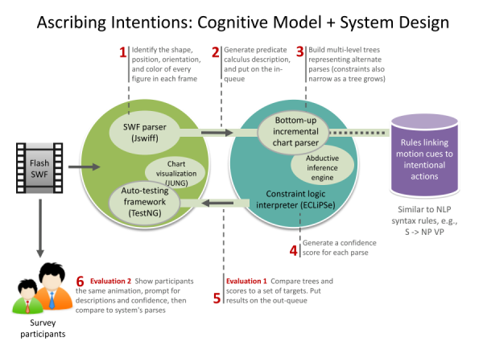
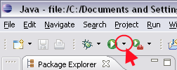
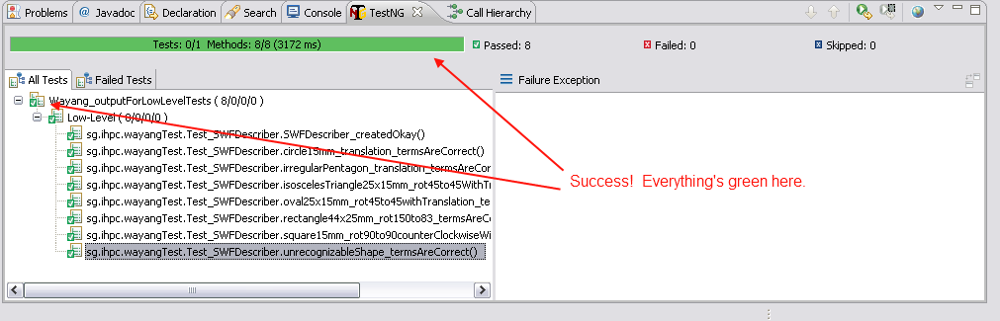
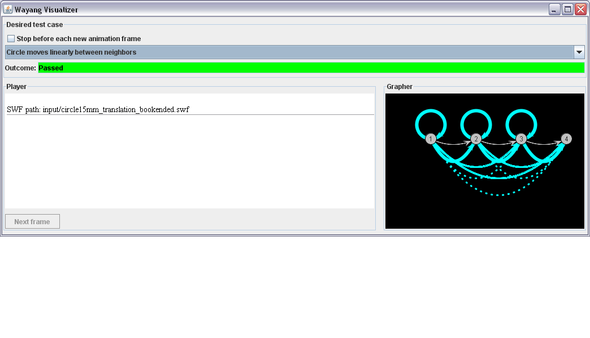

# README.md for the Wayang project

## Contents

* [[About](#about)]
* [[System design](#design)]
* [[How to setup](#setup)]
  * [[Cloning](#cloning)]
  * [[Installing](#installing)]
  * [[Configuring Eclipse IDE](#configuring-ide)]
* [[Running automated tests](#running-tests)]

* [[How to run](#running)]
* [[What you should expect to see](#output)]
* [[The Visualizer](#viz)]
* [[How to create test cases](#testcases)]
* [[Requirements for input SWFs](#restrictions)]
* [[Logging](#logging)]
* [[Troubleshooting](#troubleshooting)]
* [[Notes](#notes)]

## [About](#about)

The Wayang project is an attempt to create a computational cognitive model of how people spontaneously attribute actions, intentions, and other mental states (or purely physical causes) to simple 2D objects based largely on their movement.

"Wayang" is an Indonesian word for theatre, specifically "shadow" and "imagination" [["Wayang" described on Wikipedia](http://en.wikipedia.org/wiki/Wayang)].

## [System design](#design)

The diagram below illustrates the major system parts of the Wayang codebase and its information flows.



## [How to setup](#setup)

The following steps will allow you to start the Wayang visualization and run high-level units tests from it. The steps also describe how to run all the low-level automated tests (which display a green or red indicator in the IDE of whether the tests passed or not).

### [Cloning](#cloning)

1. Clone https://github.com/David-dp-/ATOM
Let's say you make its local folderpath to be **{atom clone}**. For me, that's `E:\davidsfolderGDrive\Projects\ClonesFromGithub\ATOM\`.
1. Clone this project, https://github.com/David-dp-/intentionperception-wayang
Let's say you make its local folderpath to be **{wayang clone}**. For me, that's `E:\davidsfolderGDrive\Projects\ClonesFromGithub\intentionperception-wayang\`.

### [Installing](#installing)

1. Ensure you've installed [[the correct version of ECLiPSe for your machine and OS](http://eclipseclp.org/Distribution/)]. Strangely, they keep [[the guidance about which installer to choose inside the installer builds, but you can read it from the source](https://sourceforge.net/projects/eclipse-clp/files/Distribution/)]. Also, beware that they provide installers over http rather than https, so there is some risk that what you will download is malware instead of the real installer.
 * For troubleshooting, `C:\Program Files\ECLiPSe 6.1\README_WIN.txt` is helpful.
1. At 2017-11-26, the stable 64-bit Windows version is 6.1 and it's installed at `C:\Program Files\ECLiPSe 6.1\`. To verify installation from the commandline:
  1. In a `cmd`, type `c: && cd \Program Files\ECLiPSe 6.1\ && lib\x86_64_nt\eclipse.exe` (I'm not sure why but the Windows installers don't put eclipse.exe in your PATH.)
  1. Verify that an ECLiPSe prompt like the following appears. Type `e` to exit to the cmd prompt.
```
    ECLiPSe Constraint Logic Programming System [kernel]
    Kernel and basic libraries copyright Cisco Systems, Inc.
    and subject to the Cisco-style Mozilla Public Licence 1.1
    (see legal/cmpl.txt or http://eclipseclp.org/licence)
    Source available at www.sourceforge.org/projects/eclipse-clp
    GMP library copyright Free Software Foundation, see legal/lgpl.txt
    For other libraries see their individual copyright notices
    Version 6.1 #216 (x86_64_nt), Sun Nov  1 21:03 2015
    [eclipse 1]:
```
  1. You might also want to make ECLiPSe's default IDE, TkEclipse, easier to use. Do `Ctrl S`, type `TkEclipse`, and select it if there's a match. Once it's running, pin it to your taskbar, and once in the taskbar, edit its Properties | Start In to be **{wayang clone}**`\test\ECLiPSe`.
    * We use .pro to indicate pure Prolog files and reserve .ecl for source that uses CLP-specific features; by default, CLP uses .pl for Prolog (which others normally use for Perl). To allow TkEclipse's file dialogs to show our .pro files by default, go into Admin mode and edit `C:\Program Files\ECLiPSe 6.1\lib_tcl\eclipse_tools.tcl` around line 200 to match these:
```
    {{ECLiPSe Files} {.ecl .pro}}
    {{Prolog Files} {.pro}}
```
1. Ensure you've installed a recent JDK: Open a cmd (on Windows) or Terminal (on other platforms) and type: `java -version` If this command is not recognized, install the most recent Java JDK, preferrably 64-bit if your OS is 64-bit. If the command is recognized, note if `64-bit` appears in the response.
1. Ensure you've installed the Eclipse IDE (for EE Developers). Note that the Eclipse IDE and ECLiPSe are entirely different applications.

### [Configuring Eclipse IDE](#configuring-ide)

1. Go to the Project menu and select Build Automatically, so the application is rebuilt every time you save one of its files.
1. Import the ATOM project, which is needed to configure the Wayang project
  1. Start Eclipse and when prompted for the workspace, select a folder that's **not** under **{atom clone}**. (I chose `E:\davidsfolderGDrive\Projects\ClonesFromGithub\CLP_workspaces\workspace_ATOM\`)
  1. In Eclipse select File | Import | General | Existing Projects Into Workspace | Select Root Directory | Browse | (select **{atom clone}**) | Finish
1. Import the Wayang project
  1. Go to File | Switch Workspace | Other | Workspace | Browse, then select a folder that's **not** under **{wayang clone}**. (I chose `E:\davidsfolderGDrive\Projects\ClonesFromGithub\CLP_workspaces\workspace_Wayang\`)
  1. In Eclipse select File | Import | General | Existing Projects Into Workspace | Select Root Directory | Browse | (select **{wayang clone}**) | Finish
  1. Configure the build path to include ATOM
    1. Right-click Wayang in the Package Explorer pane | Properties | Java Build Path | Projects tab
    1. If ATOM is listed but `(missing)` is displayed alongside it, select it and click Remove
    1. Go to the Source tab, select Link Source | Linked Folder Location | Browse | (select **{atom clone}**)
    1. For troubleshooting, the [[online help for Eclipse version Luna](https://help.eclipse.org/luna/index.jsp?topic=%2Forg.eclipse.jdt.doc.user%2Freference%2Fref-properties-build-path.htm)] might help.
1. Ensure you've installed support for the TestNG Java testing framework
  1. You install it as a "Software Update" to the IDE. Go to Help | Install New Software
  1. In the lower-right, un-select 'Hide items that are already installed' in case you've already installed TestNG
  1. At the top in the Work With textbox, enter: `http://beust.com/eclipse` and hit your Enter key.
  1. `TestNG` should appear in the listbox. Select its checkbox, then near the bottom hit the Next button.
  1. When the dialog is titled 'Install Details', hit Next again.
  1. When the dialog is titled 'Review License', select 'I accept' and hit the Finish button.
  1. If you see a dialog warning that you are installing unsigned content, hit the Install Anyway button.
  1. When prompted, hit the Restart Eclipse button in the dialog.
  1. For troubleshooting, the following steps are adapted from [a more general how-to I wrote for setting up TestNG](https://intentionperception.org/2010/01/how-to-enable-testng-launch-configurations-in-eclipse-ide-windows/).
1. Create launch configurations (These steps are adapted from chapter 8, "Using the Java-ECLiPSe Interface" in http://eclipseclp.org/doc/embedding.pdf)
  1. Ensure you haven't hidden any launch configuration types: Go to Window | Preferences | Run/Debug | Launching | Launch Configurations. On the right side, make sure that Java Application and TestNG are shown and not checked. (You may have to check 'Filter checked launch types' temporarily in order to scroll or uncheck some items.) Click the `Apply and Close` button.
  1. Create a launch configuration for low-level Java-only tests; these tests don't depend on ECLiPSe CLP. (The IDE doesn't save launch configurations to a project file, AFAIK, so I can't checkin one for you; each person has to recreate mine.)
    1. Go to the top menu bar and click the down-facing black triangle to the right of the Run button (a green circle with a white triangle in it).  This should trigger a dropdown menu that includes "Run Configurations..." Select it.
    1. Select TestNG in the left pane, then click the New button in the upper left (the white rectangle with a yellow plus in the upper right).
    1. Enter name `Wayang_LowLevel_JavaOnly` for the new launch config
    1. Under the Test tab,
      1. Use the Browse button for the Project field and select Wayang.
        * If Wayang is missing, there was probably a problem when setting the ATOM or Wayang workspace or importing those projects. Try right-clicking Wayang in the Package Explorer pane, select Delete. When prompted about whether to delete files on disk, do not do so (or you will have to re-clone). Switch to the ATOM workspace and do the same to ATOM in the Package Explorer. Now re-import both as directed above.
      1. Select the Suite radio button and use the Browse button to select test/testng_LowLevel_JavaOnly.xml
      1. To save your edits, click Apply. When you're done editing, click Close. (We give steps later to verify through a run.) 
  1. Create a launch configuration for "low-level" tests that **do** depend on ECLiPSe CLP.
    1. In the Run Configurations dialog, select `Wayang_LowLevel_JavaOnly` in the listbox and then click the Copy button above the listbox.
    1. In the new configuration, set Name to `Wayang_LowLevel_DependsOnCLP`
    1. Under the Test tab, verify that the Project field shows Wayang
    1. Select the Suite radio button and use the Browse button to select test/testng_LowLevel_DependsOnCLP.xml
    1. Under the Arguments tab in the VM Arguments box, enter `-Declipse.directory="`**{eclipse_clp installation}**`" -Xms128M -Xmx256M`. The latter part tells the IDE to increase the amount of RAM allocated to this Java application.
    1. (UNSURE) Select the Classpath tab, then User Entries | Add External JARs | **{eclipse_clp installation}**`/lib/eclipse.jar`
    1. To save your edits, click Apply. When you're done editing, click Close (or you could execute the test by clicking Run).
        
## [Running automated tests](#running-tests)

1. Verify that the low-level tests were setup correctly
  1. Run the Java-only tests by selecting the black triangle again near the green Run button, and then selecting Wayang_LowLevel_JavaOnly
  1. The Console tab should show something like the following:
```
[Parser] Running:
_pathToYourProject_\Wayang\test\testng_LowLevel.xml
.
...Wayang settings:             Shapes fudge factor = 4
.                            Twips per spatial unit = 65.8
Error to allow when comparing successive magnitudes = 0.1
.                                       Graph width = 400
.                                      Graph height = 200
.                             Graph node separation = 80
.                                      Graph margin = 30
.  Configured perceptual limits:
.      minPerceptibleAreaChangePerMsec = 0.1
.       minPerceptibleChangeInPosition = 2.0
.    minAreaOverDistanceToAvoidFlicker = 4.0
.                   minPerceptibleArea = 4.0
.          minPerceptibleRGBDifference = 8.0
.         maxElapsedTimeToAvoidFlicker = 90.0
.     minPerceptibleColorChangePerMsec = 0.5
...LocalPathToSWF = input/circle15mm_translation.swf
...Confirmed that file is SWF formatted.
...Properties in SWF header:         SWF version = 8
.                                    frame count = 5
.                                     frame rate = 24; so, msec between frames = 41.0
.                               background width = 10999twips ~ 167 spatial units
.                                         height = 7999twips ~ 122 spatial units
.                                          color = RGB (255; 255; 255)
_Output for various other test SWF files omitted._
.
Wayang_outputForLowLevelTests
Total tests run: 8, Failures: 0, Skips: 0
```
**At 2017-11-26, 7 out of 8 tests now fail. The failures are due to a mismatch in the expected and actual output strings for the arguments of a 'ground' predication. I suspect the rules for inferring this predication were changed without running an automated test at the time. I suspect these arguments indicate the coordinates of a figure detected in the foreground of the .swf. The initial frames of the swf should be manually inspected to see if either the old or new arguments are correct.**
  1. A similar, more graphical view of the summary report should be available under the TestNG tab (sometimes labelled _Results of running suite_).  This is the green/red indicator of success I mentioned above. If the indicator is red, click on one of the methods below it that have a failure indicator. The right pane should show a stacktrace for the error.
  1. Run the tests that depend on ECLiPSe CLP by selecting the black triangle again near the green Run button, and then selecting Wayang_LowLevel_DependsOnCLP. Output should be similar to Wayang_LowLevel_JavaOnly.
  1. Verify that the high-level tests were setup correctly by using the Run button's dropdown menu again and selecting "Wayang_HighLevel"

## [[How to run](#running)]

We run Wayang only through automated tests, but if you wanted to run it as a regular Java application, you could create a Run Configuration like this:
    
1. Select Java Application in the left pane instead of TestNG, then click the New button in the upper left.
1. Enter whatever name you like.
1. Under the Main tab,
  1. Use the Browse button for the Project field and select Wayang
  1. For Main class, enter sg.ihpc.wayangTest.Main. Leave the checkboxes unselected.
1. Under the Arguments tab,
  1. In the VM Arguments box, enter "-Declipse.directory="C:\Program Files\ECLiPSe 6.0" -Xms128M -Xmx256M". (The latter part tells the IDE to increase the amount of RAM allocated to this Java application.)
1. To save your edits, click Apply. When you're done editing, click Close.

## [[What you should expect to see](#output)]

**At 2017-11-26, nothing beyond this point in this doc has been updated since 2013.**

The console shows the following when the high-level tests first start running:

* * *

<pre>...Wayang settings:                 Shapes fudge factor = 4
                                   Twips per spatial unit = 65.8
    Error to allow when comparing successive magnitudes = 0.1
                                            Graph width = 400
                                           Graph height = 200
                                  Graph node separation = 80
                                           Graph margin = 30
                      Num different arc widths in graph = 6
   Configured perceptual limits:
     minPerceptibleAreaChangePerMsec = 0.1
     minPerceptibleChangeInPosition = 2.0
     minAreaOverDistanceToAvoidFlicker = 4.0
     minPerceptibleArea = 4.0
     minPerceptibleRGBDifference = 8.0
     maxElapsedTimeToAvoidFlicker = 90.0
     minPerceptibleColorChangePerMsec = 0.5
...Confirmed that file is SWF formatted.
...Properties in SWF header:         SWF version = 8
                                     frame count = 3
                                      frame rate = 24; so, msec between frames = 41.0
                                background width = 10999twips ~ 167 spatial units
                                          height = 7999twips ~ 122 spatial units
                                           color = RGB (255; 255; 255)
Loaded the ATOM project.

Asserted <rule(stationarytrajectory_basestep, <="(cause(figureHasTrajectory(FigureId," stationarytrajectory,="" elapsedtime1,="" elapsedtime2,="" cf,="" originally(shape1,="" color1),="" []),="" [[timestamp(elapsedtime1),="" figure(figureid,="" position1,="" shape1,="" color1)],="" [timestamp(elapsedtime2),="" position2,="" shape2,="" color2)]]),="" [1="" :="" compute([position1="position(X1," y1),="" position2="position(X2," y2)]),="" 2="" compute(stationarytrajectory="stationaryTrajectory(originalPosition(X1," y1))),="" 3="" compute(figureisstationary(figureid,="" observ1(elapsedtime1,="" observ2(elapsedtime2,="" color2),="" stationarytrajectory)),="" 4="" compute(cf="" is="" 0.7)]))="">

Asserted <rule(linearmovingtrajectory_basestep, <="(cause(figureHasTrajectory(FigureId," linearmovingtrajectory,="" elapsedtime1,="" elapsedtime2,="" cf,="" originally(shape1,="" color1),="" []),="" [[timestamp(elapsedtime1),="" figure(figureid,="" position1,="" shape1,="" color1)],="" [timestamp(elapsedtime2),="" position2,="" shape2,="" color2)]]),="" [1="" :="" compute([position1="position(X1," y1),="" position2="position(X2," y2)]),="" 2="" compute(linearmovingtrajectory="linearMovingTrajectory(lastPosition(X2," y2),="" magnitude(xmagn,="" ymagn))),="" 3="" compute(figuremoveslinearly(figureid,="" observ1(elapsedtime1,="" observ2(elapsedtime2,="" color2),="" linearmovingtrajectory)),="" 4="" compute(cf="" is="" 0.65)]))="">

Asserted <rule(trajectory_recursivestep, <="(cause(figureHasTrajectory(FigureId," trajectory2,="" elapsedtime1,="" elapsedtime3,="" cf3,="" originally(shape1,="" color1),="" drawinstrs),="" [figurehastrajectory(figureid,="" trajectory1,="" elapsedtime2,="" cf2,="" _drawinstrs1),="" [timestamp(elapsedtime3),="" figure(figureid,="" position3,="" shape3,="" color3)]]),="" [1="" :="" compute(position3="position(X3," y3)),="" 2="" compute((trajectory1="stationaryTrajectory(originalPosition(X2," y2)),="" trajectory2="stationaryTrajectory(originalPosition(X3," constraint="figureIsStationary(FigureId," observ1(elapsedtime2,="" position(x2,="" y2),="" shape1,="" observ2(elapsedtime3,="" color3),="" trajectory2),="" call(constraint),="" gendrawinstructions(constraint,="" confidencegrowthfactor="0.15)" ;="" (trajectory1="linearMovingTrajectory(lastPosition(X2," magnitude(xmagn1,="" ymagn1)),="" y3),="" magnitude(xmagn2,="" ymagn2)),="" gendrawinstructions([constraint|trajectory1],="" magnitudesarewithinerrorrange(xmagn1,="" xmagn2),="" magnitudesarewithinerrorrange(ymagn1,="" ymagn2),="" 4="" compute(incrementconfidenceasymptotically(cf2,="" confidencegrowthfactor,="" cf3))]))="">Created new OutOfProcessEclipse inference engine</rule(trajectory_recursivestep,> </rule(linearmovingtrajectory_basestep,></rule(stationarytrajectory_basestep,></pre>

* * *

Note that ATOM is an inference engine I wrote in early 2009 and then ported to ECLiPSe. It does inference for Wayang.)

Here's an overview of what the values mean above:

1.  **Shapes fudge factor** - How many spatial units the longer axis can be from the shorter axis when deciding if a shape is a square or rectangle (or circle versus oval).
2.  **Twips per spatial unit** - Distance measurements that are encoded in SWFs are in "twips" units, and the Adobe docs say that a twip is a "logical pixel" size rather than an actual pixel size, since actual pixel sizes depend on what resolution you've set your display to. We want to measure everything in spatial units so we can compare to what experimental participants see on a screen; we found conversion factor 56.7 on a forum page.
3.  **Error to allow when comparing successive magnitudes** - The amount of "wiggle room" to allow when comparing a speed+direction impetus vector from one pair of observations with a similar vector from another pair of observations -- to see if the figure is moving consistently. (The value is currently a guess, to be informed by experiment).
4.  **Perceptual limits** - When frame descriptions arrive at the Observer Model (the CLP side) they are checked to determine which (if any) of the figures in the frame are perceptible -- a figure might be too small or too similar in color to the background; such figures are filtered out before the parser can "see" them.
5.  **SWF version** - Wayang depends on a 3rd party SWF parser, Jswiff, which only works with SWFs encoded in Flash version 8 and below. If you encounter weird Wayang behavior for a new SWF, be sure to check the version number displayed here.
6.  **frame rate** - A value set in the SWF file that tells Flash players how fast to play it; Wayang uses it to determine an "elapsed time (msec)" value to give to each description it creates of successive frames.
7.  **color** - The color of the background. RGB(255;255;255) is white. Although Wayang generates descriptions of the color of each figure and the background, it doesn't use such descriptions currently (e.g., it doesn't try to determine if a figure is invisible due to having the same color as the background, and then pretend it doesn't know about the figure).

At the end of a successful run of the high-level tests, you <s>should</s> might see a section like this in the console,

* * *

<pre>TERM IN: settings([minPerceptibleAreaChangePerMsec(0.1), minPerceptibleChangeInPosition(2.0), minPerceptibleArea(4.0), minAreaOverDistanceToAvoidFlicker(4.0), minPerceptibleRGBDifference(8.0), maxElapsedTimeToAvoidFlicker(90.0), minPerceptibleColorChangePerMsec(0.5), maxAllowableErrorInMagnitude(0.1)])
TERM IN: frame([timestamp(0), ground(167, 122, color(255, 255, 255)), figure(1, position(100, 55), circle(13), color(0, 0, 255)), figure(2, position(70, 19), circle(13), color(51, 255, 0)), figure(3, position(61, 35), circle(13), color(255, 0, 0))])
TERM OUT: edgeSummary("edge1", [], 1, 2, "list", "completed", "[[timestamp(0), ground(167, 122, color(255, 255, 255)), figure(1, position(100, 55), circle(13), color(0, 0, 255)), figure(2, position(70, 19), circle(13), color(51, 255, 0)), figure(3, position(61, 35), circle(13), color(255, 0, 0))], 1.0, [[timestamp(0), ground(167, 122, color(255, 255, 255)), figure(1, position(100, 55), circle(13), color(0, 0, 255)), figure(2, position(70, 19), circle(13), color(51, 255, 0)), figure(3, position(61, 35), circle(13), color(255, 0, 0))]], []]")
TERM OUT: edgeSummary("edge2", ["edge1"], 1, 1, "figureHasTrajectory", "incomplete", "[figureHasTrajectory(1, linearMovingTrajectory(lastPosition(X2, Y2), magnitude(XMagn, YMagn)), 0, ElapsedTime2, 0.65, originally(circle(13), color(0, 0, 255))), 0.65, [], [[timestamp(0), figure(1, position(100, 55), circle(13), color(0, 0, 255))], [timestamp(ElapsedTime2), figure(1, position(X2, Y2), Shape2, Color2)]]]")
</pre>

* * *

followed by a section like this:

* * *

<pre>TERM OUT: edgeSummary("edge64", ["edge36", "edge20"], 2, 4, "figureHasTrajectory", "completed", "[figureHasTrajectory(3, linearMovingTrajectory(lastPosition(87, 52), magnitude(0.317073170731707, 0.195121951219512)), 41, 82, 0.65, originally(circle(13), color(255, 0, 0))), 0.65, [figureHasTrajectory(3, linearMovingTrajectory(lastPosition(87, 52), magnitude(0.317073170731707, 0.195121951219512)), 41, 82, 0.65, originally(circle(13), color(255, 0, 0))), [[timestamp(41), ground(167, 122, color(255, 255, 255)), figure(1, position(100, 55), circle(13), color(0, 0, 255)), figure(2, position(70, 19), circle(13), color(51, 255, 0)), figure(3, position(74, 44), circle(13), color(255, 0, 0))]], [[timestamp(82), ground(167, 122, color(255, 255, 255)), figure(1, position(100, 55), circle(13), color(0, 0, 255)), figure(2, position(70, 19), circle(13), color(51, 255, 0)), figure(3, position(87, 52), circle(13), color(255, 0, 0))]]], []]")
TERM OUT: edgeSummary("edge65", ["edge64"], 2, 2, "figureHasTrajectory", "incomplete", "[figureHasTrajectory(3, linearMovingTrajectory(lastPosition(X3, Y3), magnitude(XMagn2, YMagn2)), 41, ElapsedTime3, 0.866666666666667, originally(circle(13), color(255, 0, 0))), 0.866666666666667, [], [figureHasTrajectory(3, linearMovingTrajectory(lastPosition(87, 52), magnitude(0.317073170731707, 0.195121951219512)), 41, 82, 0.65, originally(circle(13), color(255, 0, 0))), [timestamp(ElapsedTime3), figure(3, position(X3, Y3), Shape3, Color3)]]]")
TERM OUT: edgeSummary("edge66", ["edge65", "edge64"], 2, 4, "figureHasTrajectory", "incomplete", "[figureHasTrajectory(3, linearMovingTrajectory(lastPosition(X3, Y3), magnitude(XMagn2, YMagn2)), 41, ElapsedTime3, 0.866666666666667, originally(circle(13), color(255, 0, 0))), 0.866666666666667, [figureHasTrajectory(3, linearMovingTrajectory(lastPosition(87, 52), magnitude(0.317073170731707, 0.195121951219512)), 41, 82, 0.65, originally(circle(13), color(255, 0, 0))), [[timestamp(41), ground(167, 122, color(255, 255, 255)), figure(1, position(100, 55), circle(13), color(0, 0, 255)), figure(2, position(70, 19), circle(13), color(51, 255, 0)), figure(3, position(74, 44), circle(13), color(255, 0, 0))]], [[timestamp(82), ground(167, 122, color(255, 255, 255)), figure(1, position(100, 55), circle(13), color(0, 0, 255)), figure(2, position(70, 19), circle(13), color(51, 255, 0)), figure(3, position(87, 52), circle(13), color(255, 0, 0))]]], [[timestamp(ElapsedTime3), figure(3, position(X3, Y3), Shape3, Color3)]]]")
TERM IN: stop
</pre>

* * *

An "edge" is just a datastructure we use to store a partially-supported explanation. (The term "edge" comes from the chart parser we have adapted.)

TO BE UPDATED:

<font color="gray">Here's what its parts mean:

*   _Incomplete/Completed_ - Completed edges represent explanations that have been fully supported; these correspond to a branchpoint in a syntax tree where all the leafs/slots of that branchpoint have been filled in. Incomplete edges are explanations that are only partially supported so far.
*   _CF_ - confidence factor, a real number in [0..1] where 1 represents total confidence, but some incomplete edges may still have just a variable such as CF2.
*   _Span_ - the frames between which the explanation applies. For example, a span of 2 4 means that frames 2 and 3 support the explanation (and frame 4 hasn't been seen yet). A completed edge whose span goes from 1 to the last frame represents an explanation that covers the entire animation.
*   _Label_ - The explanation or description that we have (partially) abduced. For example, `hasImpetus(5, [11, 12], 20, ..., 0.88)` means that figure 5 has an impetus of 11 in the X direction and 12 in the Y direction at elapsed time 20msec with confidence factor .88.
*   _Scenes identified_ - Conditions that the label depended on and which have been satisfied. (Note: There should be no variables in these scene terms. Variables start with a capital letter.)
*   _Scenes expected_ - Conditions that the label depends on and which have NOT yet been satisfied. The parser will look to support these by matching them to upcoming frames (or inferences drawn from frames). (Note: These terms will almost always include variables that represent figures, times, and other values that are expected.)
*   <font color="red">NEW:</font> _Filterings_ - Descriptions in predicate calculus of any figure that might have been filtered out because it wouldn't have been perceptible.
*   <font color="red">NEW:</font> _Discontinuities_ - Descriptions of any figure state, such as a big change in size or color, that prevented a continuity rule from firing. These are meant not just for informational purposes but also to act as triggers for discontinuity-spanning rules (to be introduced later).
*   <font color="red">NEW:</font> _Tips_ - Descriptions of figure states that might indicate a bug in the knowledge base, or that might reflect desired behavior for an unusual test case.

</font>

## [[The Visualizer](#viz)]

This screen capture shows, on the right, a visualization of the chart parser data structures after running the "Circle moves linearly between neighbors" high-level test. The space on the left is a place-holder for an SWF player that will show overlays of what Wayang infers. 

The graph on the right can be interpreted this way:

1.  Each node represents a frame; for example, node 1 represents the first frame
2.  Nodes and arcs are never moved nor altered. Each one represents a completed step of reasoning that later reasoning can use to build more inclusive hypotheses.
3.  All arcs point rightward (sometimes arrow heads are obscured by other arrow heads). Each arc represents one or more rules that are hypothesized to connect all the frames between the start and end nodes. For example, a **solid** arc from node 1 to node 3 represents **completed** rules that have satisfied all of their conditions by matching them to frames 1 through 3, while a **dotted** arc from 1 to 3 would represent **incomplete** rules that have satisfied only some of their conditions and which will be looking at the next higher-numbered node to see if they can complete themselves.
4.  "Self-loop" arcs (i.e., those that start and end at the same node) are nothing special; they're just incomplete rules that have managed to match only their first condition.
5.  Notice that some arcs start at node 2 or later. One might think that there would be no point in creating a hypothesis that can't cover the whole span because it doesn't even cover the first node, but a chart parser actually looks for short arcs in order to build longer ones. For example, arcs from 1 to 3 and from 3 to 4 might be used to build a new arc from 1 to 4.
6.  Arcs of different colors use different concepts. Gray arcs represent just the starting description of each frame; these arcs are always complete/solid and always have just length 1\. Green arcs represent the concept "figureHasImpetus". Because "figureHasImpetus" is currently our most high-level and thus most interesting kind of hypothesis, a solid green arc that spans all nodes represents the most "compelling" hypothesis one can hope for for any input animation. We will use other colors for the concepts of intention and physical causes.

Such graphs are just the start of a visualizer debugging tool we're building. See doc/VisualizerRequirements.txt for details.

## [[How to create test cases](#testcases)]

The following steps should be followed to create new test cases:

1.  Under `Wayang\test\ECLiPSe\`, create a file whose name begins with `test_`. This file should contain an ECLiPSe test predicate whose name should end with `_edgesAreCorrect` for consistent naming. The body of this predicate should consist of 2 predicate calls: `populateEdgeSummariesForVerification/1` followed by `processFrames/0`. `populateEdgeSummariesForVerification/1` should be called with a term provided in the same file. The name of this term should end with `_edgeSummaries`, again, for consistent naming. The term should have 1 argument, which is the list of all the expected edge summaries to compare against. Each edge summary is enclosed in an `edgeSummary` term. Below is an example layout of the file:

    * * *

    <pre>     
    circleTranslation_edgesAreCorrect :-
    populateEdgeSummariesForVerification(circleTranslation_edgeSummaries),

    processFrames.

    % The canonical set of completed and incomplete edges for the "circle15mm_translation.swf" scenario.
    %
    circleTranslation_edgeSummaries(
    [edgeSummary("edge1", [], 1, 2, "list", "completed", "[[timestamp(0), ground(167, 122, color(255, 255, 255)), figure(1, position(61, 35), circle(13), color(255, 0, 0))], 1.0, [[timestamp(0), ground(167, 122, color(255, 255, 255)), figure(1, position(61, 35), circle(13), color(255, 0, 0))]], []]")
    ,edgeSummary("edge2", ["edge1"], 1, 1, "figureHasTrajectory", "incomplete", "[figureHasTrajectory(1, linearMovingTrajectory(lastPosition(X2, Y2), magnitude(XMagn, YMagn)), 0, ElapsedTime2, 0.65, originally(circle(13), color(255, 0, 0))), 0.65, [], [[timestamp(0), figure(1, position(61, 35), circle(13), color(255, 0, 0))], [timestamp(ElapsedTime2), figure(1, position(X2, Y2), Shape2, Color2)]]]")
    ,edgeSummary("edge3", ["edge2", "edge1"], 1, 2, "figureHasTrajectory", "incomplete", "[figureHasTrajectory(1, linearMovingTrajectory(lastPosition(X2, Y2), magnitude(XMagn, YMagn)), 0, ElapsedTime2, 0.65, originally(circle(13), color(255, 0, 0))), 0.65, [[timestamp(0), ground(167, 122, color(255, 255, 255)), figure(1, position(61, 35), circle(13), color(255, 0, 0))]], [[timestamp(ElapsedTime2), figure(1, position(X2, Y2), Shape2, Color2)]]]")
    ,edgeSummary("edge4", ["edge1"], 1, 1, "figureHasTrajectory", "incomplete", "[figureHasTrajectory(1, stationaryTrajectory(originalPosition(61, 35)), 0, ElapsedTime2, 0.7, originally(circle(13), color(255, 0, 0))), 0.7, [], [[timestamp(0), figure(1, position(61, 35), circle(13), color(255, 0, 0))], [timestamp(ElapsedTime2), figure(1, position(X2, Y2), Shape2, Color2)]]]")
    ]).

         </pre>

    * * *

2.  The steps below explain how to generate the edge summaries in the list above:
    1.  Create the file whose name begins with `test_` as outlined above, but instead of providing the list of expected edge summaries in the `_edgeSummaries` term, provide an empty list `[]`.
    2.  In `Wayang\test\sg\ihpc\wayangTest\viz\VizTestsDropdown.java` class, there is a `VizTestsDropdownItem` vector called `_coTestItems`. This vector contains the dropdown items corresponding to the high-level tests that can be run in the visualizer. In the constructor of VizTestsDropdown class, add the new test case to the vector as the following example shows:

        * * *

        <pre>_coTestItems.add(
        	new VizTestsDropdownItem(
        			"Lone circle moves curvilinearly", //Label for the dropdown item
        			"src/ECLiPSe/Observer/KnowledgeBase_curvedTrajectory.ecl", //knowledge base file that contains the relevant rules
        			"input/circle15mm_curvedTrajectory.swf", //the input .swf file
        			"test/ECLiPSe/test_circleCurvedTrajectory.pro", //the test file
        			"circleCurvedTrajectory_edgesAreCorrect", //the test predicate in the test file that needs to be run  
        			oViz ));
         	 	 </pre>

        * * *

    3.  Run the high level test using the visualizer. As previously described, at the end of the high level test, you might see an output such as the following:

        * * *

        <pre>TERM IN: settings([minPerceptibleAreaChangePerMsec(0.1), minPerceptibleChangeInPosition(2.0), minPerceptibleArea(4.0), minAreaOverDistanceToAvoidFlicker(4.0), minPerceptibleRGBDifference(8.0), maxElapsedTimeToAvoidFlicker(90.0), minPerceptibleColorChangePerMsec(0.5), maxAllowableErrorInMagnitude(0.1)])
        TERM IN: frame([timestamp(0), ground(167, 122, color(255, 255, 255)), figure(1, position(100, 55), circle(13), color(0, 0, 255)), figure(2, position(70, 19), circle(13), color(51, 255, 0)), figure(3, position(61, 35), circle(13), color(255, 0, 0))])
        TERM OUT: edgeSummary("edge1", [], 1, 2, "list", "completed", "[[timestamp(0), ground(167, 122, color(255, 255, 255)), figure(1, position(100, 55), circle(13), color(0, 0, 255)), figure(2, position(70, 19), circle(13), color(51, 255, 0)), figure(3, position(61, 35), circle(13), color(255, 0, 0))], 1.0, [[timestamp(0), ground(167, 122, color(255, 255, 255)), figure(1, position(100, 55), circle(13), color(0, 0, 255)), figure(2, position(70, 19), circle(13), color(51, 255, 0)), figure(3, position(61, 35), circle(13), color(255, 0, 0))]], []]")
        TERM OUT: edgeSummary("edge2", ["edge1"], 1, 1, "figureHasTrajectory", "incomplete", "[figureHasTrajectory(1, linearMovingTrajectory(lastPosition(X2, Y2), magnitude(XMagn, YMagn)), 0, ElapsedTime2, 0.65, originally(circle(13), color(0, 0, 255))), 0.65, [], [[timestamp(0), figure(1, position(100, 55), circle(13), color(0, 0, 255))], [timestamp(ElapsedTime2), figure(1, position(X2, Y2), Shape2, Color2)]]]")
        		 </pre>

        * * *

        Each of the edge summaries provided as output terms should be collected and then examined for correctness. If the edge summaries are deemed to be correct, they are ready to be collected and added into the expected edge summary list. This edge summary list should replace the empty list.
3.  It is also possible to run tests in a standalone mode, purely on the ECLiPSe CLP side. In the same folder which contains the `test_` files, there are corresponding files whose names begin with `standalone_`. Such files should follow the structure of the following example file:

    * * *

    <pre>:- compile('stubsAndUtilsForStandalone.pro', 
    	'../../src/ECLiPSe/Observer/KnowledgeBase_curvedTrajectory.ecl'
       ).

    :- resetStandalone.

    :- assert( inputForDebugging([ settings([minPerceptibleAreaChangePerMsec(0.1), 
                                             minPerceptibleChangeInPosition(2.0), 
                                             minPerceptibleArea(4.0), 
                                             minAreaOverDistanceToAvoidFlicker(4.0), 
                                             minPerceptibleRGBDifference(8.0), 
                                             maxElapsedTimeToAvoidFlicker(90.0), 
                                             minPerceptibleColorChangePerMsec(0.5), 
                                             maxAllowableErrorInMagnitude(0.1), 
                                             maxAllowableErrorInDegrees(3.0)
                                            ])
                                  ,frame([timestamp(0), ground(167, 122, color(255, 255, 255)), figure(1, position(84, 61), circle(13), color(51, 255, 0))])
                                  ,frame([timestamp(41), ground(167, 122, color(255, 255, 255)), figure(1, position(88, 65), circle(13), color(51, 255, 0))])
                                  ,frame([timestamp(82), ground(167, 122, color(255, 255, 255)), figure(1, position(94, 67), circle(13), color(51, 255, 0))])
                                  ,frame([timestamp(123), ground(167, 122, color(255, 255, 255)), figure(1, position(100, 65), circle(13), color(51, 255, 0))])
                                  ,frame([timestamp(164), ground(167, 122, color(255, 255, 255)), figure(1, position(105, 61), circle(13), color(51, 255, 0))])
                                  ,endOfFrames
                                 ])).

    :- compile('test_circleCurvedTrajectory.pro').
     	 </pre>

    * * *

    It is structured as follows:
    *   The first part loads `'stubsAndUtilsForStandalone.pro'` which contains necessary predicates, as well as the relevant knowledge base file.
    *   The `resetStandalone/1` predicate is called to do necessary steps prior to the test run.
    *   `inputForDebugging/1` contains a list of inputs that include the relevant settings as well as frame items that replace inputs that would be passed if an actual high-level test were run from the visualizer. The inputs simulate actual inputs from a `.swf` file. These inputs should be retrieved from a corresponding high-level test output which are labeled `TERM IN` (see above).
    *   Lastly, the corresponding `test_` file is loaded.The `standalone_` file should be run through TkEclipse. The relevant test predicate to call is the predicate in the `test_` file whose name ends with `_edgesAreCorrect`.

## [Requirements for input SWFs](#restrictions)

*   Neither sprites nor "movie symbols" can be used; use "graphic symbols" instead
*   Visible figures must never overlap
    *   Figures that are intended to appear to touch must be exactly 1mm apart during the time when they should appear to touch. (Note: the code doesn't yet detect touching, but it will need this requirement to be followed if it is ever to do so.)
    *   Figures that must be composed of several shapes, such as walls with corners, must be perfectly adjacent to the other parts of the figure that they are connected to; that is, there must be neither any overlap nor any gap. (Note: the code doesn't yet detect adjacent shapes in order to assemble them into a larger single figure, but it will need this requirement if it is ever to do so.)
*   All figures must be visually distinguishable from each other based on a label or color. Labels and colors must not change across frames. Figure colors must be easily distinguished from the background color. (We make these requirements because the code has access to a unique identifier for each figure that people can't see, so to keep participants on a level field with the code, one must provide visual uniqueness. We require that these properties not change because the code ignores them, and if they changed then participants and the code would not be comparable in their reactions.)
*   <font color="red">SOON TO CHANGE:</font> Figures must all be circles of the same size, because while the SWFDescriber code can distinguish shape and size differences, there aren't yet any rules in the reasoning part that can take advantage of such distinctions.
*   <font color="red">NEW:</font> Any figures whose shape isn't in set {triangle,circle,oval,square,rectangle} will be filtered out by perceptibilityFilter.pro because we don't have a way of calculating their area, so we can't assess their salience. (Another reason is that we can't tell if they change shape, which if it happened, should count as a discontinuity and therefore require handling by a specialized rule.)
*   Figures may not enter or leave the frame, because the code has no knowledge yet of how to interpret such actions.
*   The file format must use SWF version 8, because we use a 3rd party library to parse the file and the library has not been updated for more recent versions.

## [[Logging](#logging)]

Logging functionality can be configured in Wayang.properties. The relevant setting parameters are:

*   loggingMethod, with the following possible values: consoleOnly, logfileOnly, consoleAndLogfile. logfileOnly and consoleAndLogfile will print the log into a file named outputLog.csv. This file is placed in the Wayang home directory.
*   loggingLevel, with the following possible values: completedEdges, allEdges, performanceData. completedEdges prints just the completed edges. allEdges prints both incomplete and completed edges. performanceData prints relevant performance data with self-explanatory headings.

## [Troubleshooting](#troubleshooting)

*   EclipseCLP doesn't support stepwise debugging in EclipseIDE, so we have to use Start | Programs | Eclipse6.0 | TkEclipse instead.
*   TkEclipse won't run the Java portions of our code, so we have to use mocked-up inputs. In TkEclipse, select File | Compile... and then select Wayang\test\ECLiPSe\standalone_circleTranslation.pro; this will load all the ATOM and Wayang code, and then it defines mocked-up inputs as if they had been parsed from input\circle15mm_translation.swf
*   To make console logging sufficiently verbose in TkEclipse, enter "assert(traceParser)" (no quotes) into the top edit box of TkEclipse to turn on logging in IncrementalParser.ecl. You probably also want to enter "assert(traceReasoner)" to turn on logging in ATOM (used by IncrementalParser).
*   Entering "circleTranslation_edgesAreCorrect" in the textbox and hitting the "run" button would be a quick way to see all the console logging for a run over the mocked input.
*   NOTE: If you need to do a second run, you need to restart TkEclipse and repeat these steps. DavidP hasn't figured out yet why this is so; it might be that one would have to retract very selectively, but he has forgotten.
*   To do stepwise debugging, do all the steps above except don't hit "run". Instead, select Tools | Predicate Browser and scroll down to verifyRule/5 on the left; highlight it, then click the "on" radio button on the right next to "spy", then click Close. Now select Tools | Tracer and click the fullscreen button in the upper right. Finally, go back to the main window and enter "circleTranslation_edgesAreCorrect" in the textbox and click Run. The Tracer window will reappear, and you can press Leap to go to the first call to verifyRule/5, or press Creep to visit the first executable line of this run. If you pressed Leap, then press Creep to see the source code in the lower pane, and keep pressing Creep to step depth-first through the code (or Skip to avoid going any deeper but advance to the next line in the current method (if any)).

## [Notes](#notes)

*   Without special effort to avoid it, new rules will tend to produce several edges that have the same start and end times and very similar LHSs. We call these "duplicates". They are not needed for modeling inference, and they bog down the system both in processing time and RAM use. Edwin has tailored some of the existing rules so that their LHS indicates whether they were produced by a "base"-case or "recursive"-case rule, so that the RHS conditions of other rules can require or reject matches to LHSs produced by one case or the other. This update to rule format allows us to prevent most ways of producing duplicates that we know of so far, with the exception of wiggle rules, for which this mechanism is not suitable and there are other duplicate reduction mechanisms for wiggle rules. However, if we eventually allow frames to be spaced irregularly in time (to mimic retinal samplings), neither the original rule format nor this tweak would prevent a new way of producing duplicates: For samples close in time to each other, base rules might produce two edges starting at the same timepoint and ending at different timepoints, one covering T1 to T2 and the other covering T1 to T3, where T2 \= T3. Edwin says that such duplicates would be prevented during regularly-spaced sequences because the perceptual filtering constraint requiring that there be no flicker would only be satisfied for one of the duplicate edges, i.e. the one that covers a shorter time period. [David: If the no-flicker constraint is what's keeping such duplicates from happening in regularly-spaced sequences, then we have a bug because that constraint is not meant to have that effect. There is an implicit constraint in many rules that there be no intervening frames among the frames explicitly mentioned in the RHS of the rule. We should probably make this adjacency constraint explicit in contingency conditions.] Edwin says a possible way to handle the fact that the no-flicker constraint no longer prevents duplicates is to supplement the constraint on maximum time gap with another constraint in trajectory base rules that constrains the frame numbers of the frames being matched such that they are sequential. [David: One might also do it by creating a "not" constraint that looks for frames with a timestamp between the two given timestamps.]

END